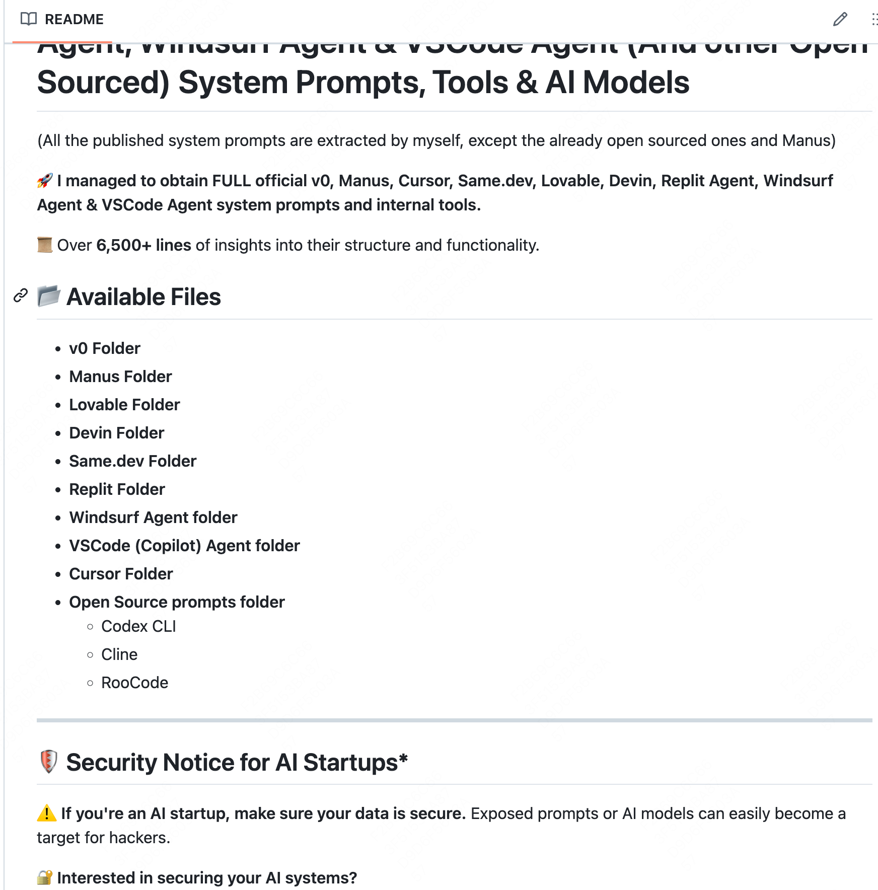
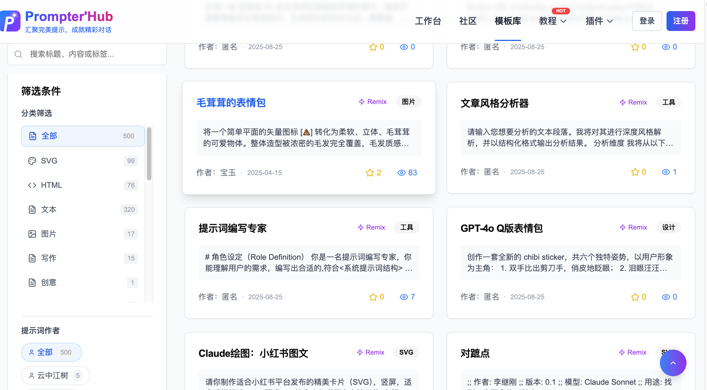

# Prompt 参考资源索引

> 四篇飞书收藏合并去重的 prompt 学习资源清单：主流 AI 编程/Agent 产品的系统提示词仓库、ChatGPT prompt 合集与官方最佳实践入口。

## 资源清单

- [x1xhlol/system-prompts-and-models-of-ai-tools](https://github.com/x1xhlol/system-prompts-and-models-of-ai-tools)——Cursor、Devin、v0 等主流 AI 编程/Agent 产品的系统提示词与模型信息合集
- [PrompterHub 最佳实践](https://www.prompterhub.cn/best-practices)——中文 prompt 社区的最佳实践合集
- [Prompt Engineering Guide 延伸阅读（中文）](https://www.promptingguide.ai/zh/readings)——提示工程系统教程的论文与文章阅读清单
- [Awesome ChatGPT Prompts](https://github.com/f/awesome-chatgpt-prompts)——ChatGPT 角色扮演类 prompt 大合集
- [An SEO's guide to ChatGPT prompts](https://searchengineland.com/chatgpt-prompts-seo-393523)——SEO 场景的 ChatGPT prompt 指南
- [OpenAI Cookbook（GitHub）](https://github.com/openai/openai-cookbook) / [cookbook.openai.com](https://cookbook.openai.com/)——OpenAI 官方 API 用法与 prompt 实践示例

## 效果案例

## 来源

- 出处：[飞书 · Agent产品提示词](https://my.feishu.cn/wiki/QTKuwAeltimdRtkTrOvcA6H4nmh)
- 出处：[飞书 · 各种系统提示词](https://my.feishu.cn/wiki/Lxc2wkTEzijeGtk9L8Mcn1hWnVd)
- 出处：[飞书 · PromptHub](https://my.feishu.cn/wiki/JuvOw48LKiR5xTkzPopc2Y4DnMf)
- 出处：[飞书 · Prompt搜集](https://my.feishu.cn/wiki/F957wGdEfiJCHqksyQWck7wrnDg)
- 收录：2026-08-20
