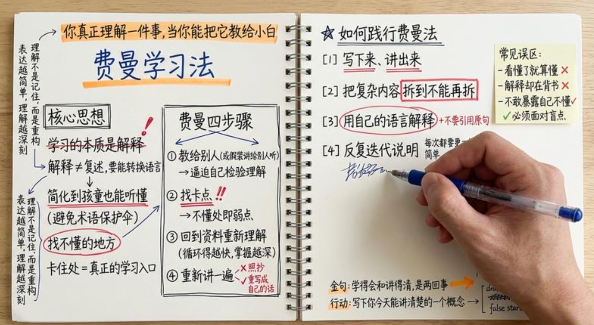

# 手绘思维模型笔记

> 用 Nano Banana 生成一张正上方俯拍、写实质感的双页螺旋笔记本手绘笔记，把一个思维模型的要点写满整页，适合做知识类内容配图。

## Prompt 原文

**费曼学习法（示例，其余思维模型可替换标题与页面内容套用）**

```text
一张从正上方俯拍的高度写实照片。画面中央是一本横向 16:9 的双页螺旋装订笔记本，被完全摊开，中央螺旋清晰可见。纸张质感真实。

右页上必须出现一只真实的人手（肤色自然，有细节纹理），正握着蓝色圆珠笔在划重点，笔尖接触纸面，动作自然，呈现书写瞬间。

整体内容极度密集、拥挤，几乎无留白。页面上布满匆忙但可辨认的中文手写字：大小不一、行距不齐、多处涂改、上下左右页边写满补充备注。字迹深浅不一，呈现真实的笔压变化。

## 画面元素：

- 红色标记笔迹遍布整个页面：圈画、下划线、方框、星号、感叹号、勾(✓)、叉(✗) 等符号

- 左页与右页内容自然衔接，有思维导图式箭头（→）从左延伸到右

- 页角、侧边贴有便签纸，写满随手补充的小字

- 桌面为浅色木桌，高级、干净、写实

- 画面整体光线柔和自然，从侧上方照射，无硬阴影

## 主题（标题手写）

“费曼学习法”（用橘红色荧光笔轻微强调）

## 顶部中央（橘红色荧光笔重点）

“你真正理解一件事，当你能把它教给小白”

## 左页（内容密集、结构略混乱但清晰）

### 左侧标题（手绘框）：“核心思想”

- 学习的本质是解释（上方有划掉重写痕迹）

→ 解释 ≠ 复述，要能转换语言

- 简化到孩童也能听懂（红笔下划线）

（关键：避免术语保护伞）

- 找不懂的地方（红色圆圈）

（结论：卡住处 = 真正的学习入口）

### 左页中段（多个箭头交错散开）

“费曼四步骤”（粗线方框）

① 教给别人（或假装讲给别人听）

   → 逼迫自己检验理解

② 找卡点（双线重点）

   → 不懂处即弱点

③ 回到资料重新理解

   （旁写补充：循环得越快，掌握越深）

④ 重新讲一遍

   （旁边有✗“照抄” 与 ✓“重写成自己的话”）

### 页边备注（小字密集）：

“理解不是记住，而是重构”

“表达越简单，理解越深刻”

## 右页（有手在书写、更密集、更凌乱）

### 右侧标题（小星星手绘装饰）：“如何践行费曼法”

【1】写下来、讲出来（红笔三道线）

【2】把复杂内容拆到不能再拆（红色重点框）

【3】用自己的语言解释（红圈 + 旁写“不要引用原句”）

【4】反复迭代说明（小字：每次都要更简单）

### 右侧边缘贴有便签（手写）：

“常见误区：

- 看懂了就算懂 ✗

- 解释却在背书 ✗

- 不敢暴露自己不懂 ✓ 必须面对盲点”

### 页面右下角（小字 + 荧光笔箭头）：

“金句：学得会和讲得清，是两回事”

“行动：写下你今天能讲清楚的一个概念 →”（箭头指向空白处，空白处有随手写又划掉的草稿）

## 整体视觉风格要求

- 俯拍角度严格为正上方

- 真实自然光，纸张纹理、笔压、乱序笔迹全部清晰

- 双页笔记连贯，内容从左流向右

- 红笔、蓝笔、橘色荧光笔痕迹真实、有轻微晕染

- 高级文具桌面风，但带明显“真实学习中”的凌乱感

- 画面横向 16:9
```

## 效果案例



## 来源

- 出处：[飞书 · 生成手绘 nano banana pro](https://my.feishu.cn/wiki/NHowwE2BLipY3sk75zMcOkx7ntg)
- 收录：2026-08-20

## 使用备注

- 原作者偏爱手绘风（平时画架构图常用 Excalidraw），认为手绘能把硬核概念变得亲切好记。
- 原文用同一套写法画了五个思维模型：费曼学习法、第一性原理、刻意练习、复利思维、机会成本，但源文档只附了「费曼学习法」这一条示例提示词；套用到其他模型时替换主题标题和左右页的具体内容即可。
