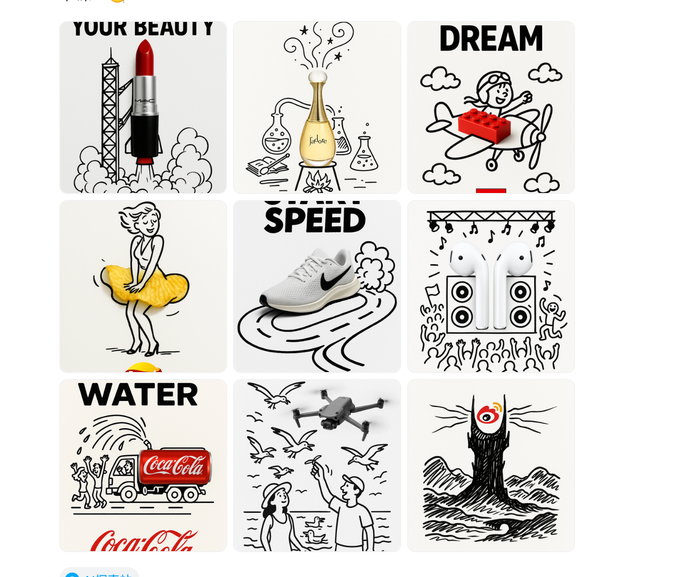

# 实物+涂鸦广告创意

> 填空式广告创意模板：把真实商品照嵌进手绘黑色墨水涂鸦场景里（如口红变火箭升空），白底高对比，顶部加粗体文案、底部放品牌 logo。替换 [商品]、[场景]、[文案]、[品牌] 四个槽位即可复用。

## Prompt 原文

**模板（含 [商品]/[场景]/[文案]/[品牌] 槽位）**

```text
简洁而富有创意的广告，背景为干净的白色背景。

一个真实的[商品]被融入到手绘的黑色墨水涂鸦中，线条流畅，趣味十足。涂鸦描绘了[场景]。在顶部添加粗体黑色“[文案]”字样。将[品牌]的标志清晰地放置在底部。视觉效果应简洁、有趣、对比度高，且概念巧妙。
```

**填好的完整示例：MAC 口红 × 火箭发射**

```text
简洁而富有创意的广告，背景为干净的白色背景。

一支真实的口红被融入到手绘的黑色墨水涂鸦中，线条流畅，趣味十足。涂鸦描绘了一个火箭发射平台，口红下方弥漫着烟雾，使其看起来像是火箭正在升空。在顶部添加粗体黑色“Launch Your Beauty”字样。将MAC的标志清晰地放置在底部。视觉效果应简洁、有趣、对比度高，且概念巧妙。
```

## 效果案例



## 来源

- 出处：[飞书 · 广告创意](https://my.feishu.cn/wiki/EYz6wykMci5MmikiQXAcZ6S9nAO)
- 原始出处：[即刻动态](https://web.okjike.com/u/FBAA4408-2343-45AD-9B4F-4ABD52FB84CA/post/6826c1eff0d718ce7ae19b71)
- 收录：2026-08-20
