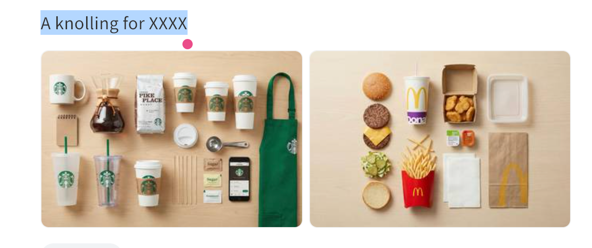

# Knolling 物品陈列图

> 极简一句话 prompt：把 XXXX 换成任意主题（一个职业、一项爱好、一台设备），生成该主题相关物件整齐平铺排列的 knolling 俯拍图。

## Prompt 原文

```text
A knolling for XXXX
```

## 效果案例



## 来源

- 出处：[飞书 · Gemini](https://my.feishu.cn/wiki/GLy3wQdx8iLqKPkfmMwcjKaTnQc)
- 原始出处：[即刻动态](https://web.okjike.com/u/0ae2afa7-9b10-4b3a-ab7e-15fbf847038d/post/692d0272a9c636d3984d2da6)
- 收录：2026-08-20
