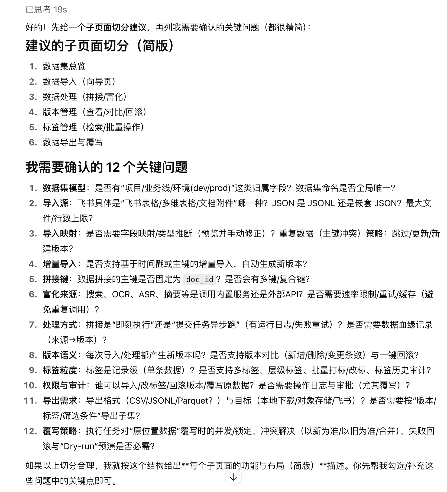

# 原型设计个人实践（页面级对话流）

> 做单个页面的原型设计时，只把核心功能诉求丢给 LLM，末尾反问"你有什么问题吗"，让它先追问再输出——以「数据管理」页面为示例的一条对话消息。

## Prompt 原文

**页面级对话消息示例：数据管理页面设计（首尾叙述句为对话原文的一部分）**

```text
不错，我现在希望进行「数据管理」页面的设计。核心功能包括：

# 数据导入
- 导入飞书、CSV、JSON等数据
# 数据处理
- 支持数据拼接功能（比如根据导入数据中的doc_id去获取对应的搜索数据，比如对应OCR、ASR、摘要信息
# 数据管理
- 版本管理：对于导入的每个数据集，都有一个单独的版本号，支持按照版本查看数据集信息
- 标签管理：数据集中有数据标签，支持按照标签增伤改查数据，当然数据处理的最小力度是单条数据（这里的背景是算法使用数据集训练时，可能会对其中某一个标签的数据进行剔除，重新标注后融合进原来的数据集中作为新的一个版本的数据集，然后进行训练）
数据导出
- 需要支持对各种数据（标注后的数据、训练数据等）进行导出
- 支持执行任务时，对原位置的数据进行修改、覆写

针对这个数据管理页面（应该是多个子页面，需要你思考如何切分比较好），你有什么问题吗？
```

## 效果案例



## 来源

- 出处：[飞书 · 原型设计Prompt（个人实践）](https://my.feishu.cn/wiki/Hz2dwxU3aimLZ1kaIcxce4x0nBf)
- 收录：2026-08-20

## 使用备注

- 只描述核心功能的诉求，让 LLM 完成页面结构梳理。
- 注意询问 LLM 有什么问题（保证没有问题的时候再开始输出**页面功能**和**页面布局**）。
- 实践反馈：LLM 给出的问题非常有启发性，能够帮助思考整个交互、功能。
